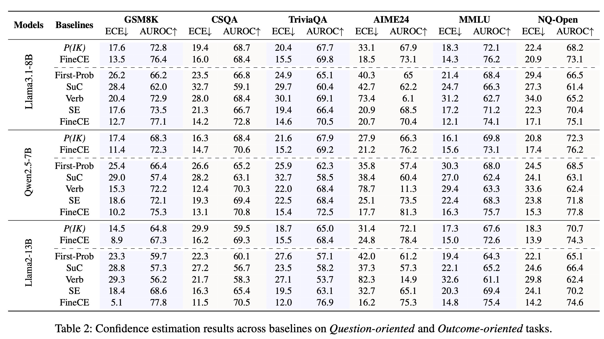

<h1 align="center">Mind the Generation Process: Fine-Grained Confidence Estimation During LLM Generation</h1>

<div align="center"> 

[](./figs/PASR_0925.pdf)
[]() 
</div>

<div align=center>
    
</div>
FineCE provides the accurate and fine-grained confidence estimates throughout the generation process of an LLM. It is also a universal method that offers confidence estimates for any given text sequence. 


- We establish a complete pipeline for constructing high-quality confidence estimation data.
- We propose BCI, a novel backward confidence integration strategy that enhances current confidence estimation by leveraging future text. 
- We develop three basic strategies to identify optimal estimation positions within the generation process.

<div align=center>
    
</div>


# Data Preparation
we provide the confidence estimation training data on the GSM8K, CSQA and TrivalQA dataset, you can find them on the fold `/data/FineCE/XX/confData`. We provide two files on each dataset using two different base models. For example, The file `LlaMA-7B.json` is from LLama2-7b.

If you want to construct the confidence estimation training data using other base models.  The pipelines is following:

- Format the model answer: We provide the formatted data on three dataset, and you can find them on the fold `/data/FineCE/XX/formatData`.  Then you can employ instruction training using <instruction, question, formatted_response> to obtain the formatted model checkpoints. For ift, we recommend you to use the  [Llama-factory](https://github.com/hiyouga/LLaMA-Factory)
- Construct the training data: You can construt the  confidence estimation training data on other tasks or using other base models using:

``` bash
cd /methods/FinCE/construct_data
python pipeline.py \
  --model_path formatted_model_path \
  --data_path raw_data_path \
  --savePath save_construct_training_data_path \
  --sample_num 30 \
  --dataSet {GSM8K, CSQA, TrivalQA} \
  --T 1 \
  --size 4
```
# Training
After construct the training data, we employ instruction-tuning based on [Llama-factory](https://github.com/hiyouga/LLaMA-Factory)

# Evaluation
``` bash
cd /methods/FineCE/infer
python infer_answer_and_conf.py \
    --model_path model_ckp \
    --data_path test_data_path \
    --response_mode conf \
```


# Baselines Implementations

We also provide the code of several popular confidence estimation methods. you can find on `/methods`

**1. P(IK):** It trains a logistic regression with the additional value ``head" added to the model to output the confidence estimated. [[Language Models (Mostly) Know What They Know]](https://arxiv.org/abs/2207.05221)

``` bash
cd /methods/PIK
python construct_data_PIK.py
--model_path the_base_model_path
--data_path  /data/test/CSQA_test.jsonP
--save_path  save_data_path
--sample_num 30
--T 1
--size 4 # the prompt size when using VLLM to infer
```
**2. First-Prob**: It uses the logits of the first token of LLM's generated answer as the confidence estimate.  [[Whose Opinions Do Language Models Reflect?]](https://arxiv.org/abs/2303.17548)


``` bash
cd /methods/First-prob
python inference_FirProb.py \
    --model_path the_base_model_path \
    --data_path  /data/test/CSQA_test.json \
    --save_path  save_data_path 
```
**3. SuC:**  It first clusters the sub-questions, and use the same confidence estimate for questions in the same cluster. [[Teaching models to express their uncertainty in words]](https://arxiv.org/abs/2205.14334)
``` bash
cd /methods/SuC
python construct_data_SuC.py \
    --model_path the_base_model_path \
    --data_path  /data/test/CSQA_test.json \
    --save_path  save_data_path \
    --sample_num 10 \
    --T 1 \
    --size 16
```
**4. Verb:**  It is a prompt-based method. It designs the prompts to guide the model to output its confidence score alongside with the generated answer. [[Just Ask for Calibration: Strategies for Eliciting Calibrated Confidence Scores from Language Models Fine-Tuned with Human Feedback]](https://arxiv.org/abs/2305.14975)
  
``` bash
cd /methods/Verb
python inference_Verb.py \
    --model_path the_base_model_path \
    --data_path  /data/test/CSQA_test.json \
    --save_path  save_data_path \
    --sample_num 10 \
    --T 1 \
    --size 16
```
**5. Fidelity:** For MCQA, it decomposes the LLM confidence into the \emph{Uncertainty} about the question and the \emph{Fidelity} to the answer generated by LLMs. [[Calibrating the Confidence of Large Language Models by Eliciting Fidelity]](https://arxiv.org/abs/2404.02655) 

Data example: ` /data/Fidelity/chains-confidence.json and /data/Fidelity/raw-10-responses.json`
``` bash
cd /methods/Fidelity
python inference_chain.py \
    --model_path the_base_model_path \
    --data_path  /data/Fidelity/chains-confidence.json \
    --save_path  /data/Fidelity/raw-10-responses.json

```

**6. LECO:** It also proposes leveraging logits to estimate step confidence. Besides, it further designs three logit-based scores that comprehensively evaluate confidence from both intra- and inter-step perspectives. [ [Learning From Correctness Without Prompting Makes LLM Efficient Reasoner]](https://arxiv.org/abs/2403.19094)

``` bash 
cd /methods/LECO
python inference_LECO.py \
    --model_path the_base_model_path \
    --data_path  /data/test/CSQA_test.json \
    --save_path  save_data_path 
```
**7. Multi-Step:** It also uses prompts to guide the model to output the process confidence and takes the average as the final result. [[Can llms express their uncertainty? an empirical evaluation of confidence elicitation in llms]](https://arxiv.org/abs/2306.13063)
```
cd /methods/Multistep
python inference_MultiStep.py \
    --model_path the_base_model_path \
    --data_path  /data/test/CSQA_test.json \
    --save_path  save_data_path \
    --sample_num 10 \
    --T 1 \
    --size 16
```
# Main Results
our method consistently outperforms all baselines in terms of ECE and AUROC, and shows excellent calibration capability across all datasets.

<div align=center>
    
</div>

<div align = center>
    
</div>
